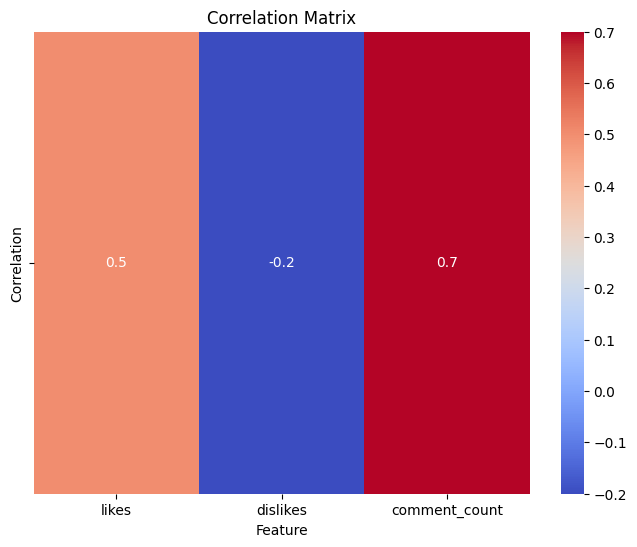
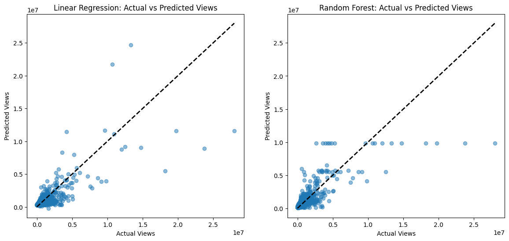
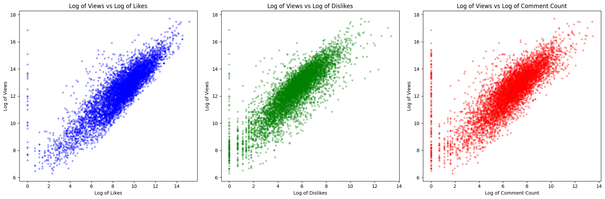

# YouTube Video Analysis with PySpark

## Overview
This project analyzes YouTube video data from the US using PySpark and machine learning techniques. The main goal is to explore the relationships between video features (such as likes, dislikes, and comment count) and video popularity (measured by view count), and to build predictive models for video views.

## Dataset
- **USvideos.csv**: Contains metadata for trending YouTube videos in the US, including views, likes, dislikes, comment count, and more.
- **US_category_id.json**: Maps category IDs to human-readable category names.

## Analysis Workflow
1. **Data Cleaning**: 
   - Remove nulls and duplicates.
   - Cast relevant columns to integer types.
   - Fill missing values for views, likes, and dislikes.
2. **Exploratory Data Analysis**:
   - Compute correlations between views and other features (likes, dislikes, comment count).
   - Visualize feature relationships and distributions.
3. **Modeling**:
   - Build and evaluate Linear Regression and Random Forest models to predict video views.
   - Compare model performance to a baseline (mean predictor).
   - Visualize actual vs. predicted views.

## Results
- **Correlations**:
  - Views and Likes: ~0.76
  - Views and Dislikes: ~0.40
  - Views and Comment Count: ~0.60
- **Model Performance (RMSE on test set)**:
  - Linear Regression: ~1,157,099
  - Random Forest: ~1,103,480
  - Baseline (mean): ~1,845,477
- Both models outperform the baseline, with Random Forest performing best.

## Dependencies
- Python 3
- [PySpark](https://spark.apache.org/docs/latest/api/python/)
- [Spark NLP](https://github.com/JohnSnowLabs/spark-nlp)
- numpy
- pandas
- matplotlib
- seaborn

Install dependencies (if running locally):
```bash
pip install pyspark spark-nlp numpy pandas matplotlib seaborn
```

## Usage
1. Place `USvideos.csv` and `US_category_id.json` in your working directory.
2. Open and run the Jupyter notebook `YT_Analysis.ipynb`.
3. The notebook will:
   - Load and preprocess the data
   - Perform analysis and modeling
   - Output results and generate plots (e.g., `cfmatrix.png`, `Graphs.png`, `Loggraph.png`)

## Outputs
- **Plots**: Correlation matrix, regression results, and other visualizations (see `cfmatrix.png`, `Graphs.png`, `Loggraph.png`).
- **Notebook**: All code and analysis steps are in `YT_Analysis.ipynb`.

## Example Plots

### Correlation Matrix


### Graphs


### Log Graph


## Project Structure
```
BIGDATA_ytAnalysis/
├── YT_Analysis.ipynb         # Main analysis notebook
├── USvideos.csv              # YouTube US trending videos dataset
├── US_category_id.json       # Category ID mapping
├── cfmatrix.png              # Output plot
├── Graphs.png                # Output plot
├── Loggraph.png              # Output plot
├── Project Documentation.docx# (Binary, not included in this summary)
```

## License
This project is for educational and research purposes.

## Acknowledgments
- YouTube for the dataset
- PySpark and Spark NLP teams

---
*For questions or contributions, please open an issue or pull request.* 